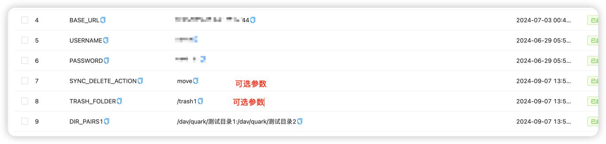
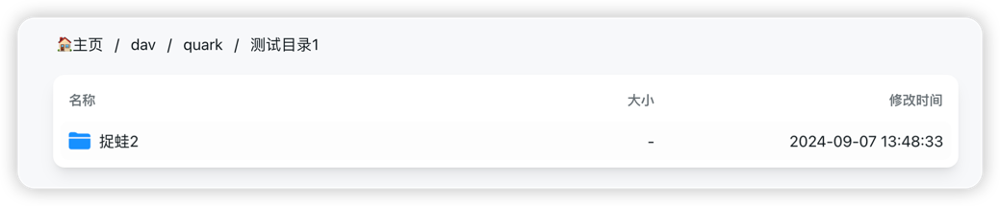
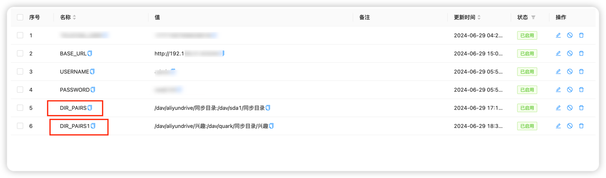

<div align="center">
  
# alist网盘自动同步
</div>

* alist可以设置目录定时转存到各个网盘，做到夸网盘，多备份的效果
* 可以将自己挂载的alist 下的各个目录相互间进行同步，原理是采用alist原始api调用执行
* 同步原理1.匹配文件名称是否相同,2.文件大小是否相同，相同会跳过同步，不同会将目标文件删除后再进行文件同步
* 目前存在的一个问题，有文件会随机同步失败，但同一个文件不会一直同步失败，建议每天同步一次，可以将同步漏了的文件补上

<div align="center">
  
[![github tag][gitHub-tag-image]][github-url] [![docker pulls][docker-pulls-image]][docker-url] [![docker image size][docker-image-size-image]][docker-url]

[gitHub-tag-image]: https://img.shields.io/github/v/tag/xjxjin/alist-sync
[docker-pulls-image]: https://img.shields.io/docker/pulls/xjxjin/alist-sync
[docker-image-size-image]: https://img.shields.io/docker/image-size/xjxjin/alist-sync
[github-url]: https://github.com/xjxjin/alist-sync
[docker-url]: https://hub.docker.com/r/xjxjin/alist-sync
</div>

## 参数

```bash
BASE_URL  服务器基础URL(结尾不带/)
USERNAME 用户名
PASSWORD  密码
DIR_PAIRS  源目录和目标目录的配对(源目录和目标目录的配对，用分号隔开，冒号分隔)
CRON_SCHEDULE 调度日期，参考cron语法   "分 时 日 月 周" 非必填，不填为一次调度
--以下参数用于目标目录有，但源目录不存在的文件处理，可选参数--
SYNC_DELETE_ACTION 同步删除动作,默认为none什么也不做，可选值为none,move,delete。
TRASH_FOLDER 当SYNC_DELETE_ACTION设置为move时，此参数生效。它指定一个目录，用于存放那些已从源目录同步到目标目录，但随后在源目录中被删除的文件。这样可以避免直接删除文件，而是将它们移动到一个指定的"回收站"目录中。(以/开头，结尾不带/)
```

### demo
```bash
docker run -d --name alist-sync \
-e TZ=Asia/Shanghai \
-e BASE_URL=http://192.168.xxx.xx:5244 \
-e USERNAME=xxx \
-e PASSWORD=xxx \
-e DIR_PAIRS=/dav/aliyundrive/同步目录/工作:/dav/quark/同步目录1/工作;/dav/quark/同步目录1/工作:/dav/aliyundrive/同步目录/工作 \
-e "CRON_SCHEDULE=5 16 * * *" \
-e SYNC_DELETE_ACTION=move \
-e TRASH_FOLDER=/trash \
xjxjin/alist-sync:latest
```

### docker-compose.yml 

```bash
name: alist-sync
services:
    alist-sync:
        container_name: alist-sync
        environment:
            - TZ=Asia/Shanghai
            - BASE_URL=http://192.168.xxx.xx:5244
            - USERNAME=xxx
            - PASSWORD=xxx
            - DIR_PAIRS=/dav/aliyundrive/同步目录/工作:/dav/quark/同步目录1/工作;/dav/quark/同步目录1/工作:/dav/aliyundrive/同步目录/工作
            - CRON_SCHEDULE=5 16 * * *
            - SYNC_DELETE_ACTION=move
            - TRASH_FOLDER=/trash
        image: xjxjin/alist-sync:latest
```

* 这个的意思是 需要将
* 源目录`/dav/aliyundrive/同步目录/工作`下的文件夹以及文件，同步到目标目录`/dav/quark/同步目录1/工作`下
* 源目录`/dav/quark/同步目录1/工作`，同步到目标目录`/dav/aliyundrive/同步目录/工作`下
* 也就是说两个目录相互备份
* 如果`/dav/aliyundrive/同步目录/工作`中删除了已同步到`/dav/quark/同步目录1/工作`的文件A,那么文件A会被移动到`/dav/quark/同步目录1/工作/trash`目录下
* **警告：在两个目录相互备份的情况下使用同步删除功能时请格外谨慎。可能导致文件永久丢失，后果自负。**

### 注意 DIR_PAIRS格式为  ，用分号隔开，冒号分隔，英文冒号，英文分号


### 青龙
需要在环境变量处设置参数

```bash
BASE_URL
USERNAME
PASSWORD
DIR_PAIRS
SYNC_DELETE_ACTION
TRASH_FOLDER
```


国内执行

```bash
ql raw https://gitee.com/xjxjin/alist-sync/raw/main/alist-sync-ql.py
```
国际执行

```bash
ql raw https://github.com/xjxjin/alist-sync/raw/main/alist-sync-ql.py
```


## 执行完成后可以在复制页面查看进度


## 2024-09-06更新
### 1.新增参数，处理目标目录有多的文件或者文件夹，但是源目录没有的处理方式,功能由【[RWDai](https://github.com/RWDai)】小哥提供
 * none 什么也不做
 * move 移动到目标目录下的trash目录
 * delete 真实删除


* 移动之前源目录


* 移动之前目标目录


* 移动之后目标目录


## 2024-05-13更新
### 1.新增文件存在判断逻辑  
 * 文件名称 
 * 文件大小
### 2.CRON_SCHEDULE 变更为参数可选
 * 当参数不传变更为一次调度，可以配合青龙远程调度

## 2024-05-23更新
* 新增青龙调度


## 2024-06-29更新
* 新增DIR_PAIRS参数个数,最多到50，参数内容和之前一致(源目录和目标目录的配对(源目录和目标目录的配对，用分号隔开，冒号分隔)),参数格式为
```bash
DIR_PAIRS
DIR_PAIRS1
DIR_PAIRS2
DIR_PAIRS3
.....
DIR_PAIRS50
```


